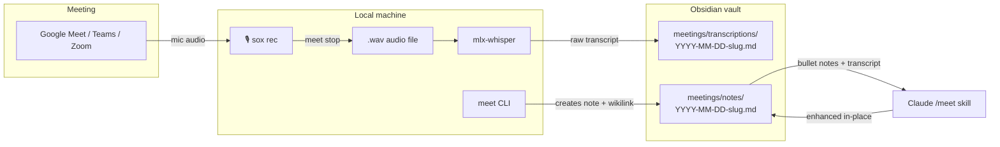

# Meet — Meeting Notes

A local, AI-enhanced meeting notes workflow inspired by Granola. Records your voice during meetings, transcribes it with Whisper, creates an Obsidian note, and lets any Claude agent structure your sparse bullet points into a full meeting report.

## Architecture



**Flow:**

1. You join a meeting on any video call platform.
2. `meet start <slug>` — sox captures mic audio in the background while you take sparse notes in Obsidian.
3. `meet stop` — stops recording, sends the `.wav` to mlx-whisper (local, Apple Silicon), and creates both the transcription and the note in the vault.
4. `/meet` — Claude reads your bullet notes + the linked transcription and rewrites the note in-place with Summary, Decisions, Action Items, and Open Questions.

Everything runs locally. No audio leaves your machine.

## How it works

```
meet start standup          # starts mic recording (sox rec in background)
  → take a few notes in Obsidian during the meeting
meet stop                   # stops recording → Whisper transcription → Obsidian notes created
  → ask Claude: /meet       # AI enhancement: Summary, Decisions, Action Items, Open Questions
```

## Vault structure

```
pkm/
  meetings/
    notes/           ← YYYY-MM-DD-slug.md  (enhanced notes, one per meeting)
    transcriptions/  ← YYYY-MM-DD-slug.md  (raw Whisper output)
  templates/
    meeting.md       ← Obsidian Templater template (auto-inserted wikilink)
```

Each note in `meetings/notes/` contains a wikilink pointing to its transcription:

```markdown
[[meetings/transcriptions/2026-04-27-standup]]
```

Wikilinks live in the **body** of the note, never in YAML frontmatter (Obsidian does not resolve links in frontmatter).

---

## System dependencies

| Dependency | Install | Used for |
|---|---|---|
| `sox` | `brew install sox` | `rec` command — records audio from mic |
| `mlx-whisper` | included in `meet` package | Apple Silicon transcription (fast, local) |

`sox` is a C binary — it is the only dependency that cannot be installed by `uv`. Everything else is handled by the Python package.

---

## Installing the CLI

The `meet/` directory is a standalone Python package. Install it as a [uv tool](https://docs.astral.sh/uv/concepts/tools/) so the `meet` command is available globally:

```bash
brew install sox                                    # system dependency (one-time)
uv tool install --python 3.13 ./meet               # installs meet to ~/.local/bin
```

Verify:

```bash
meet --help
meet status   # should print "No active recording."
```

> `uv tool install` puts the `meet` binary at `~/.local/bin/meet`. Make sure `~/.local/bin` is in your shell `$PATH` (uv adds this automatically if you follow the uv install instructions).

---

## CLI commands

```bash
meet start <slug>            # start recording (slug = short name, e.g. "standup")
meet stop                    # stop + transcribe + create Obsidian notes
meet stop --no-transcribe    # stop without running Whisper (faster, no transcript)
meet stop --model mlx-community/whisper-large-v3-turbo  # use a larger model
meet status                  # check whether a recording is active
```

The slug is sanitised to lowercase kebab-case. Recording state is persisted to `~/.meet/current.json` so `meet stop` works from any shell or Raycast.

---

## Whisper model quality vs speed

| Model | Speed (Apple M-series) | Quality |
|---|---|---|
| `mlx-community/whisper-small` | Fast (~30s for 1h meeting) | Good for most meetings |
| `mlx-community/whisper-large-v3-turbo` | Moderate | Better for accents / technical jargon |
| `mlx-community/whisper-large-v3` | Slow | Best accuracy |

Default is `whisper-small`. Override with `meet stop --model mlx-community/whisper-large-v3-turbo`.

---

## AI enhancement skill

Once the note is created, open it in Obsidian, add any notes you took during the meeting (a few bullet points is enough), then ask Claude to enhance it:

```
/meet                                              # in Claude Code
enhance my meeting notes at meetings/notes/2026-04-27-standup.md
```

Claude reads the note and the auto-detected transcription, and rewrites the file in-place:

```markdown
---
date: 2026-04-27
attendees: [borja, alice, rob]
tags: [meeting]
project: infra
---

[[meetings/transcriptions/2026-04-27-standup]]

## Summary
...

## Decisions
...

## Action Items
- [ ] Investigate PerfectScale cost impact — @rob
- [ ] Open ticket for node pool review — @alice

## Open Questions
- Is the staging environment also affected?

## Raw Notes
(your original bullet points, verbatim)
```

The skill never modifies YAML frontmatter, never invents information, and always preserves your raw notes at the bottom.

---

## Activating from Raycast

`install.sh` installs two Raycast Script Commands: **Start Meeting Recording** and **Stop Meeting Recording**. They appear in Raycast as soon as you add your scripts directory.

**One-time setup in Raycast:**

1. Open Raycast → Settings (`⌘,`) → Extensions → Script Commands
2. Click **Add Directory** and select the directory where `install.sh` copied the scripts (default: `~/Library/Application Support/Raycast/scripts/`)
3. Search "Meeting" in Raycast — both commands appear

**Why no venv activation is needed:** `uv tool install` puts `meet` at `~/.local/bin/meet`. The Raycast scripts prepend `~/.local/bin` to `$PATH` before calling `meet`, so no virtual environment activation is required. Raycast's sandboxed shell does not inherit your shell's `$PATH`, which is why the PATH export is explicit in the script.

**Usage:**
- `Start Meeting Recording` → Raycast prompts for a slug → starts recording in the background
- `Stop Meeting Recording` → stops sox, runs Whisper, creates Obsidian notes, shows confirmation

---

## Obsidian Templater template

`install.sh` copies `skills/meet/vault/templates/meeting.md` to `<vault>/templates/meeting.md`. If you have the [Templater plugin](https://github.com/SilverStreet/Templater) installed, you can create a new meeting note from this template and it will auto-fill the date and wikilink.

To use: in Obsidian, open the Command Palette → **Templater: Create new note from template** → select `meeting`.
