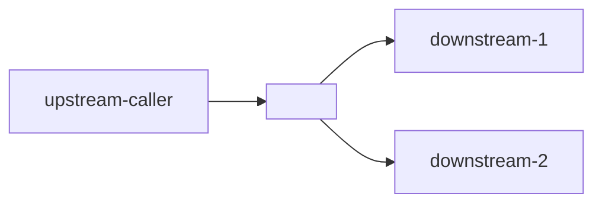

# Datadog Service Health

## Hard Constraints — READ-ONLY in Datadog

**This skill is read-only against Datadog.** All output lives **exclusively** in the Obsidian vault under `{{DATADOG_TRIAGE_DIR}}/`. Datadog itself is never written to.

You **MUST NOT** call any of the following Datadog MCP tools, regardless of any legacy text further down in this document, "just one widget" reasoning, or caller request:

- `create_datadog_notebook` — never. This skill does not create notebooks.
- `edit_datadog_notebook` — never as part of triage.
- `upsert_datadog_dashboard` — never. Permanent dashboards are managed by humans.
- `get_widget`, `validate_dashboard_widget`, `ask_widget_expert`, `get_widget_reference` — never. Findings are surfaced as live Datadog UI deep-links inside the Markdown report, not as embedded widgets.

If you find yourself about to call any of the above: stop, re-read this block, and instead construct the equivalent Datadog UI URL (APM service, traces query, single trace, monitor, dashboard, event explorer) and put it in the Evidence table.

The downstream `datadog-report-publisher` enforces the same constraints. If it ever drops a `notebook_cells` field you sent, that's the constraints working — do not retry.

---

Opinionated APM-centric health check for a single service in a given environment. Covers the Golden Signals (latency, errors, traffic, saturation indicators) via Datadog APM and correlates with monitors/dependencies.

Every run produces an evidence-linked triage note under `{{DATADOG_TRIAGE_DIR}}/` (see [docs/triage-architecture.md](../../docs/triage-architecture.md)).

## When to Use

Trigger when the user asks to:

- "Check the health of `<service>` in staging/prod"
- "Is `<service>` degraded right now?"
- "Latency spike on `<service>` — what happened?"
- "Error rate investigation for `<service>`"
- "APM triage for `<service>` around <time window>"
- As the service-scoped step of the `datadog-triage` orchestrator.

Do **NOT** use this skill for:

- Raw log exploration → use `datadog-logs-analyzer`.
- Ad-hoc metric spikes not tied to a service → use `datadog-metrics-investigator`.
- Post-mortem authoring → manual work in `{{INCIDENTS_DIR}}`.

## Required MCP

Datadog MCP server (`plugin-datadog-datadog`) with these tools:

- `search_datadog_services` — locate the service, owner team, description.
- `search_datadog_service_dependencies` — upstream/downstream graph.
- `aggregate_spans` — p50/p95/p99, error rate, throughput by resource.
- `search_datadog_spans` — inspect individual error spans for concrete failures.
- `get_datadog_trace` — drill into a representative failing trace.
- `search_datadog_monitors` — which monitors are alerting / in OK for this service.
- `search_datadog_events` — recent deploys / config changes affecting the service.
- `datadog-report-publisher` (delegated skill) for final publication.

## Inputs

Collect from the user; ask only if missing:

1. **service** (required): Datadog service name. If the user gives a fuzzy name, call `search_datadog_services` first and confirm the exact match.
2. **env** (required): `staging | prod | local | other`.
3. **time_window** (optional, default `1h`): e.g. `15m`, `1h`, `4h`, `24h`. Normalise to `from` / `to` timestamps for MCP calls.
4. **incident_id** (optional): if this health check is part of incident triage, pass through to the report.
5. **baseline_window** (optional, default `previous equal-length window`): for comparing "before vs now".

## Workflow

### Step 0 — Init audit trail

Maintain a list of every MCP query executed with timestamp, tool name, argument summary, and purpose. This trail is required in the final report.

### Step 1 — Resolve the service

```
search_datadog_services(query="<service>")
```

Confirm:
- Exact service name
- Team / owner
- Description / links
- Whether `env:<env>` has recent traces

If the service is not found or has no traces in `env` during the window, stop and report to the user (do not fabricate data).

### Step 2 — Golden Signals (aggregate)

Call `aggregate_spans` with these aggregations in parallel when possible:

| Signal | Aggregation | Group by | Purpose |
|--------|-------------|----------|---------|
| Throughput | `count` over time | (none) | Baseline traffic shape |
| Error rate | `count` of `status:error` / `count` total | `resource_name` | Which endpoints fail |
| Latency p95 | `p95(duration)` over time | `resource_name` | Slow endpoints |
| Latency p99 | `p99(duration)` | `resource_name` | Tail latency |
| Errors by code | `count` of `status:error` | `http.status_code` | 4xx vs 5xx |
| Errors by downstream | `count` of `status:error` | `peer.service` | Upstream offenders |

Common filter: `service:<service> env:<env>`.

Compare against `baseline_window` for each signal to detect regressions. Flag any metric that moved > 50% vs baseline as "significant regression" in the report.

### Step 3 — Inspect representative error spans

For the top 2–3 offending resources identified above, call `search_datadog_spans`:

```
query: service:<service> env:<env> status:error resource_name:<top_offender>
limit: 5
custom_attributes: [error.message, error.stack, http.status_code, peer.service]
```

Extract:
- Distinct `error.message` values (group manually — stack traces often vary but the message is stable).
- At least one `trace_id` for the "canonical" error, to drill down in the next step.

### Step 4 — Drill into a canonical failing trace

For the most representative `trace_id` from Step 3:

```
get_datadog_trace(trace_id=<id>, only_service_entry_spans=true)
```

Capture:
- `trace_deep_link_url` (include in evidence).
- Which downstream service (if any) is the actual failure origin — often the error is "caused" by a downstream timeout, not the service under investigation.
- End-to-end latency breakdown.

If the trace is huge, stick with `only_service_entry_spans=true`; expand only specific spans if the summary is ambiguous.

### Step 5 — Dependency graph

```
search_datadog_service_dependencies(service=<service>)
```

Build a small Mermaid diagram for the report:



Cross-reference: if Step 4 identified a downstream as the failure origin, make sure it appears in the graph and flag it in the report.

### Step 6 — Monitor coverage

```
search_datadog_monitors(query="service:<service>")
```

For each monitor:

- Status (`OK | Alert | Warn | No Data | Muted`).
- Type (metric, apm, log).
- Whether it fires on the signal we just flagged as regressing.

**Gap check**: if the investigation revealed a degraded signal that has no monitor, flag it in the "Recommendations → Observability gaps" section.

### Step 7 — Recent events (deploys, config changes)

```
search_datadog_events(query="service:<service> env:<env>", time=<window extended to 24h back>)
```

Look for deploy events, config-change events, or incident markers that coincide with the regression onset from Step 2. Pin any correlation in the Timeline.

### Step 8 — Synthesise findings

Structure the evidence into the payload expected by `datadog-report-publisher`:

- `scope`: `{ service, env, project: <team>, resource: <top-offending-resource>, severity, incident_id }`
- `findings`:
  - `Executive Summary`: 3–5 lines. State health verdict (healthy / degraded / broken), primary offending resource(s), likely cause class (timeout / 5xx / latency regression / capacity / downstream), whether a recent deploy correlates.
  - `Evidence`: every table row from Steps 2–7, with MCP tool, args summary, and **a Datadog UI deep-link** (APM service page, traces query, single-trace deep link, dashboard, monitor, event explorer). Every row must have a clickable URL — knowledge lives in Obsidian, but the live data lives one click away in Datadog.
  - `Timeline`: onset of regression, correlated events, first/last seen of key error.
  - `Root Cause`: if clear from the trace + deploy correlation; otherwise "unknown — see follow-ups".
  - `Recommendations`:
    - **P1**: rollback if deploy-correlated; increase capacity if saturation; circuit-breaker if downstream is down.
    - **P2**: fix the underlying error, add missing monitor.
    - **P3**: SLO review, architectural changes.
  - `Query Audit Trail`: all MCP calls from the running list.
- `datadog_links`: 3–6 curated live Datadog UI URLs to surface in the MD header — typically the APM service page, the failing-traces query, the canonical trace deep-link, and any relevant dashboard / monitor.

> Do **NOT** include `notebook_cells` in the payload. The publisher will silently drop it (per its Hard Constraints) and you will have wasted tokens.

### Step 9 — Publish

Invoke the `datadog-report-publisher` skill with the payload. It will:

1. Write the MD to `{{DATADOG_TRIAGE_DIR}}/<YYYY-MM-DD>-<service>-<env>.md` with all evidence rows linking to live Datadog UI URLs.
2. Return the file path.

> **No Datadog notebook is created.** Knowledge lives in the Obsidian vault only; the MD's evidence table and `datadog_links` header give the reader one-click access to live charts in the Datadog UI.

Present to the user with a 3-line summary:

```
Verdict:   <healthy|degraded|broken>
Top issue: <short phrase>
Report:    <md-path>
```

## Severity Guidance

Pick `severity` based on the worst observed signal in the window:

| Severity | Trigger |
|----------|---------|
| `critical` | Error rate > 5% for > 5m in prod, OR p99 > 3× baseline, OR incident_id set with SEV-1/2 |
| `error` | Error rate > 1% in prod OR > 5% in staging, OR p95 > 2× baseline |
| `warn` | Noticeable regression (> 50% on any golden signal) but within SLO |
| `info` | Service healthy; report is a routine check |

## Example Usage

User: "Check the health of `data-ai-studio-backend` in staging for the last hour"

Agent flow:

1. Confirm inputs: `service=data-ai-studio-backend`, `env=staging`, `time_window=1h`.
2. `search_datadog_services(query="data-ai-studio-backend")` → confirm exact name and team.
3. Run the golden signals aggregations (Step 2).
4. If any regressed: inspect error spans, drill into a trace, check dependencies, monitors, and deploy events.
5. Build the findings payload.
6. Delegate to `datadog-report-publisher`.
7. Return verdict + links to the user.

Example filename produced: `2026-04-21-data-ai-studio-backend-staging.md`.

## Edge Cases

- **No traces for service in env**: the service may not be instrumented in that env. Report clearly and suggest instrumentation follow-up.
- **Window too short (< 5m)**: p95/p99 will be noisy. Warn the user and extend to at least 15m for stable percentiles.
- **Service name ambiguity**: always confirm the exact DD service name via `search_datadog_services` before proceeding.
- **High-traffic service**: queries may timeout; reduce the window or add more selective filters (by resource_name).

## Best Practices

1. **Baseline comparison is non-negotiable** — "p95 is 500ms" means nothing without knowing it was 120ms an hour ago.
2. **Always drill one level**: aggregate → top offender → one raw span → one full trace. Do not stop at aggregates.
3. **Correlate with deploys** — Step 7 catches >50% of real incidents in practice.
4. **Monitor gap flagging** — if we had to find the regression manually, there's an observability gap worth naming.
5. **Frozen artefact** — once published, do not mutate. If new evidence arrives, create a follow-up triage note and cross-link.

## Dependencies

Required:
- Datadog MCP server `plugin-datadog-datadog`.
- `datadog-report-publisher` skill installed.

Optional:
- `create-runbook` skill (invoked manually when a pattern repeats ≥ 2 times).
